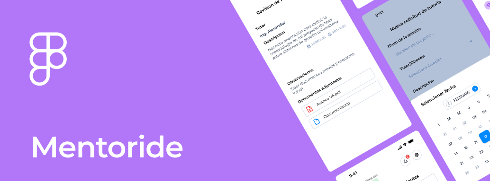
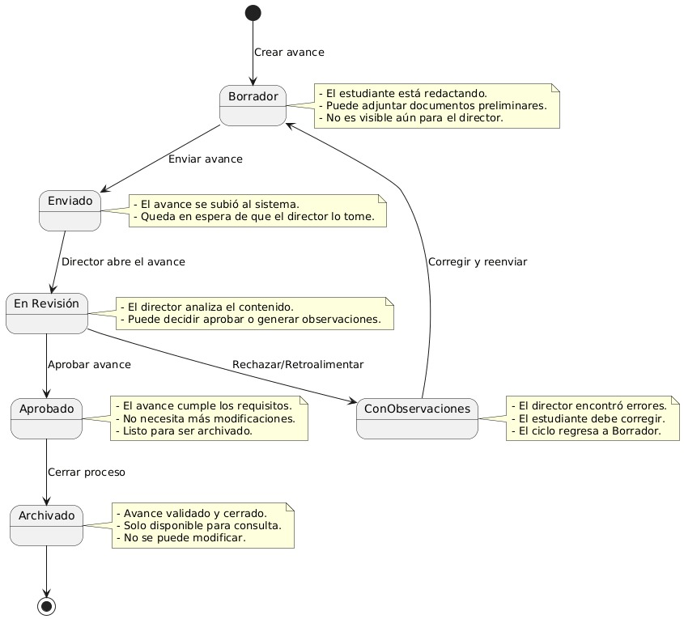
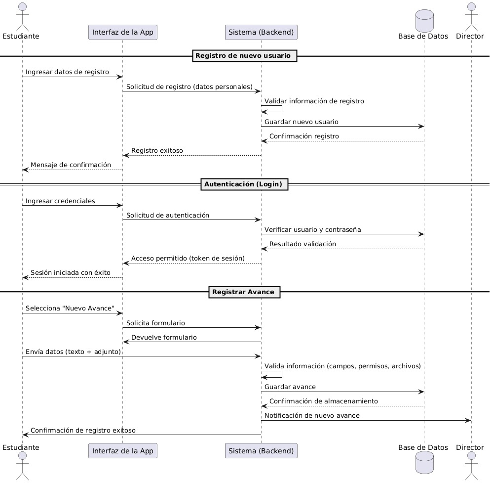

# Mentoride

**Descripción**  
App para gestionar y dar seguimiento a tutorías de trabajos de grado y encuentros entre estudiantes y directores en la **Universidad de Cundinamarca**.

---

## Funcionalidades Principales

- Registro de avances con estados: **Borrador → Enviado → En Revisión → Aprobado**
- Programación de tutorías entre estudiantes y directores
- Gestión documental con aprobación/corrección de documentos
- Sistema de retroalimentación integrado

---

## Diseño
[](https://www.figma.com/design/PUdRjegJE8jWPI3ACZAH5z/Mentoride-Tutor-App?node-id=26-2&t=G8SwWGmgTJUKRv5S-1)

---

## 📊 Diagramas UML

### Diagrama de Estados


### Diagrama de Secuencia


### Diagrama de Casos de uso


## Instalación

```bash
git clone https://github.com/Yaancarlos/mentorideuc.git
cd mentorideuc
npm install
npm expo start