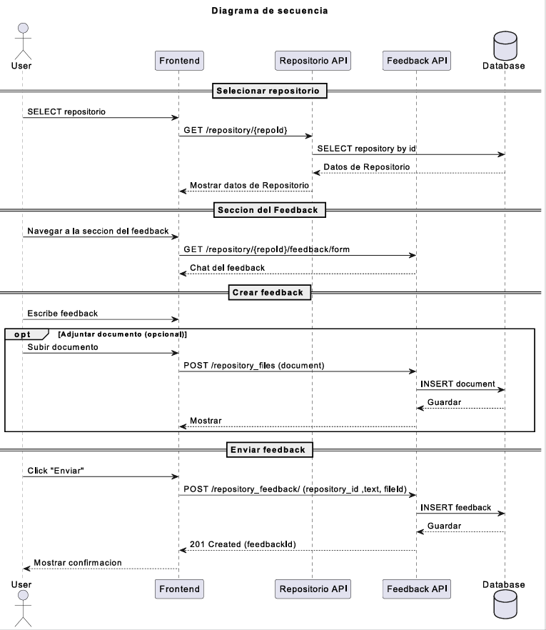
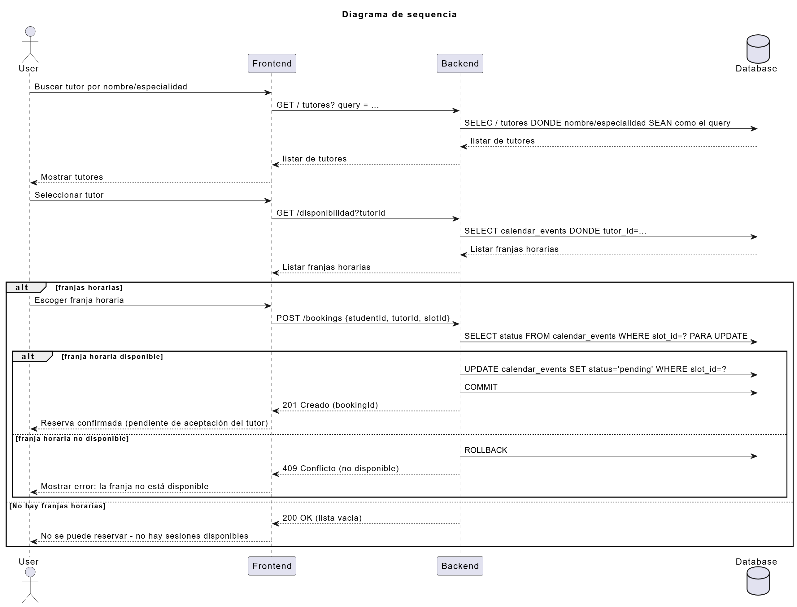
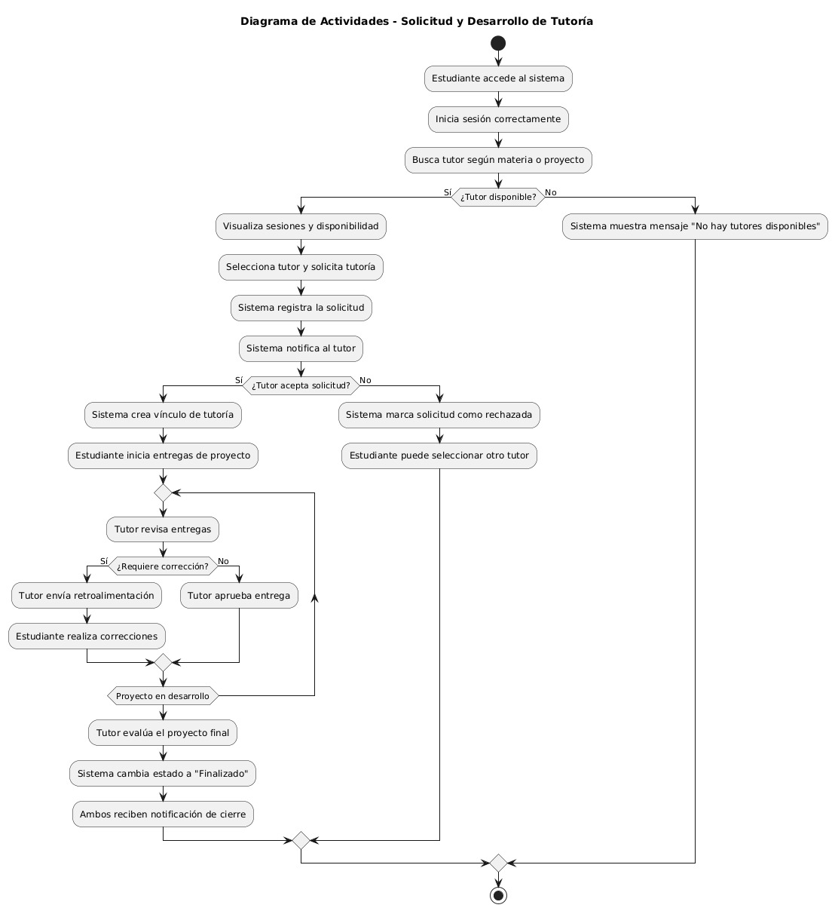
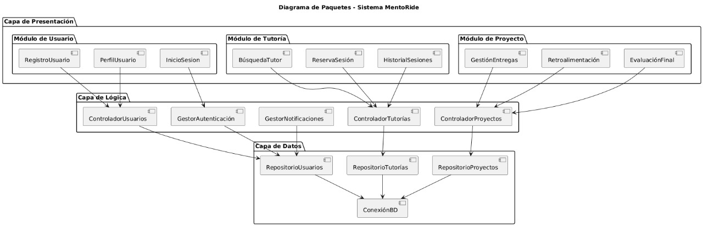
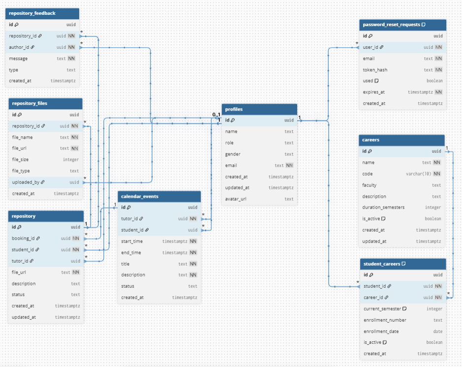
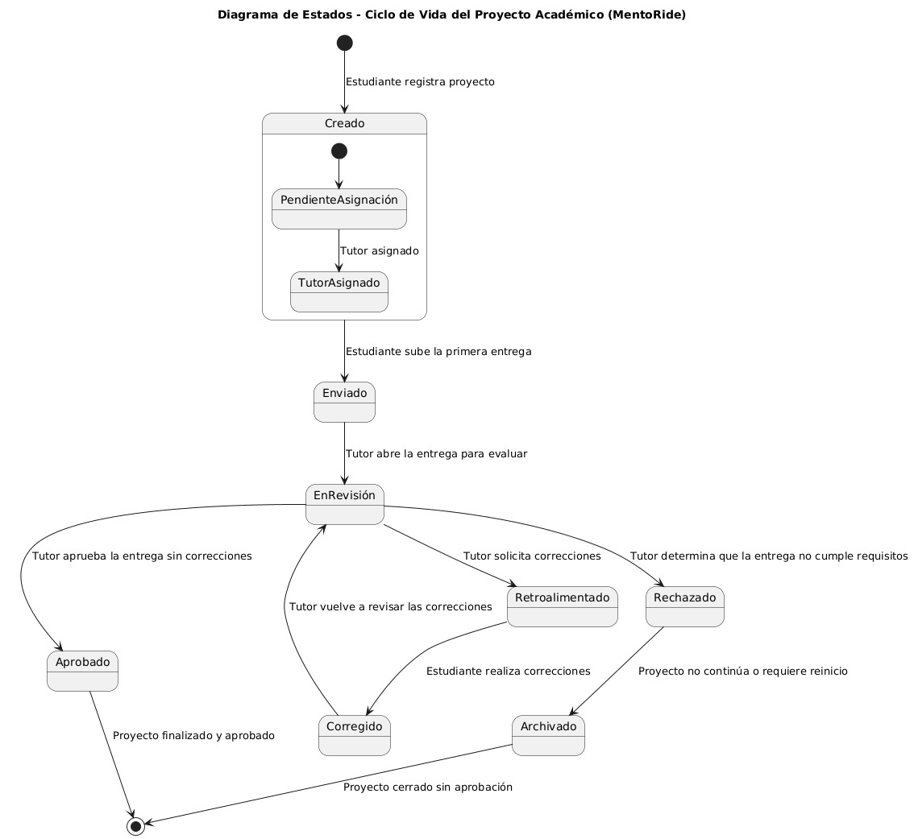
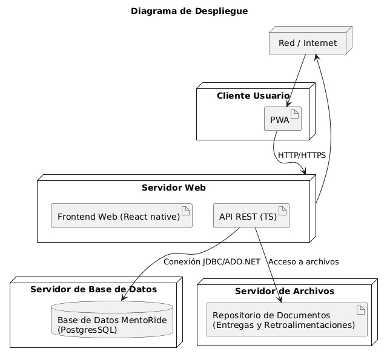
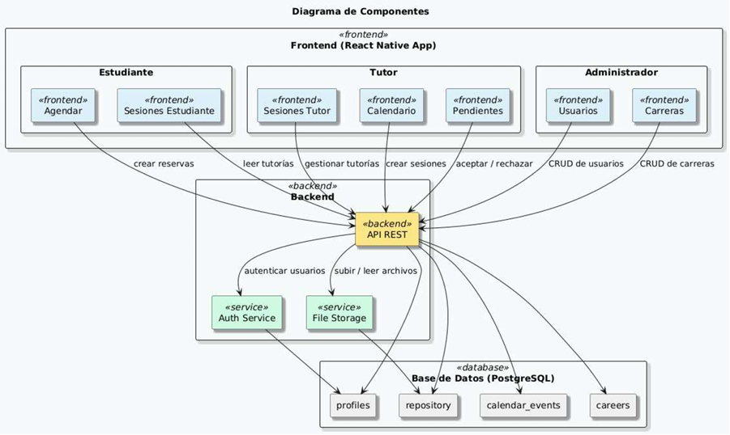
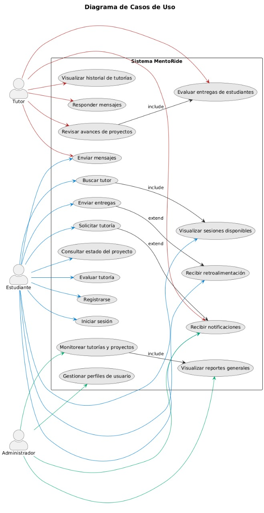

## 📊 Diagramas UML

### Diagrama de Secuencia avanze

### Diagrama de Secuencia asignacion

### Diagrama de actividades

### Diagrama de paquetes

### Diagrama de DB

### Diagrama de Estados

### Diagrama de despliege

### Diagrama de componentes

### Diagrama de Casos de Uso
